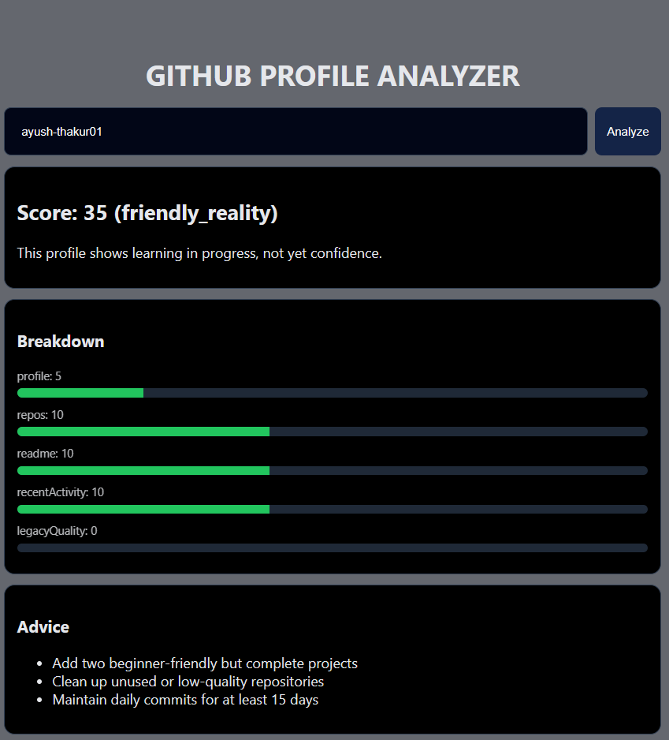
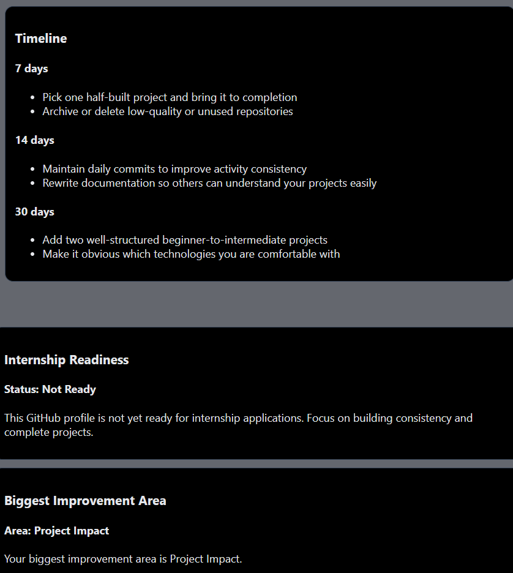

# 🔥 GitHub Roast Analyzer

A backend-focused web project that analyzes a GitHub profile and provides a **score-based evaluation**,  
**friendly technical roast**, **detailed breakdown**, and a **7 / 14 / 30 day improvement roadmap**.

This project is built to demonstrate **backend logic, API integration, clean architecture, and problem-solving skills**, making it suitable for **internship and entry-level roles**.

---

## 🎯 Why This Project?

Recruiters often evaluate candidates using their GitHub profiles, but:
- Students don’t know what’s wrong with their profile
- Feedback is generic or unavailable

This tool acts like a **technical mentor**:
- Points out weaknesses honestly
- Explains *why* the score is low/high
- Suggests **clear, time-bound improvements**

---

## 🚀 Key Features

- 🔢 **GitHub Profile Scoring (0–100)**
- 🎭 **Tone-based Technical Roast**
  - Savage (very weak profiles)
  - Friendly reality check
  - Motivational feedback
  - Praise + push
  - Legacy but inactive detection
- 📊 **Detailed Score Breakdown**
  - Profile completeness
  - Repository quality
  - Documentation (README)
  - Recent activity
  - Legacy / past impact
- 🛠️ **Custom Advice Generation**
- ⏳ **7 / 14 / 30 Day Improvement Roadmap**
- 🌙 Simple frontend UI (in progress)
- 🎯 Internship Readiness Verdict (Not Ready / Almost Ready / Internship Ready)
- ⚠️ Biggest Improvement Area detection based on profile analysis


---

## 🧠 System Design Overview

1. User enters a GitHub username  
2. Backend fetches public data using GitHub REST API  
3. Rule-based scoring logic evaluates the profile  
4. Context-aware roast and advice are generated  
5. Timeline-based roadmap is returned as JSON  
6. Frontend displays the results


## 📸 Interface Preview

### Home Screen


### Profile Analysis Result


### Timeline & Roadmap



---

## 🛠️ Tech Stack

### Backend
- Node.js
- Express.js
- GitHub Public API
- CORS

### Frontend
- HTML
- CSS
- JavaScript

### Tools & Practices
- Git & GitHub
- REST API design
- Modular backend architecture
- Clean commit history

---

## 📂 Project Structure

```text
github-roast-analyzer/
│
├── index.js                # Express server (API entry point)
├── logic/
│   ├── score.js            # Scoring logic
│   ├── roast.js            # Roast & tone decision logic
│   ├── advice.js           # Custom advice generator
│   └── timelineAdvice.js   # 7/14/30 day roadmap logic
│
├── frontend/
│   ├── index.html          # UI structure
│   ├── style.css           # UI styling
│   └── script.js           # Frontend logic
│
├── package.json
├── package-lock.json
├── .gitignore
└── LICENSE


## Run Locally

Clone the project

```bash
git clone https://github.com/ayush-thakur01/github-roast-analyzer.git

```

Go to the project directory

```bash
 cd github-roast-analyzer
```

Install dependencies

```bash
  npm install
```

Start the  backend server/frontend server

```bash
  node index.js
  frontend/index.html
```


